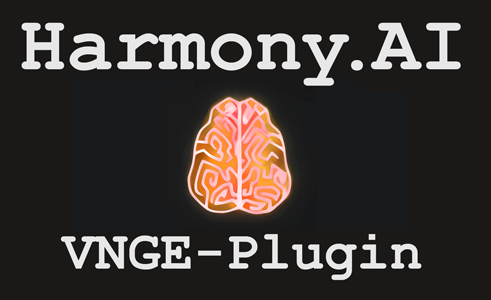
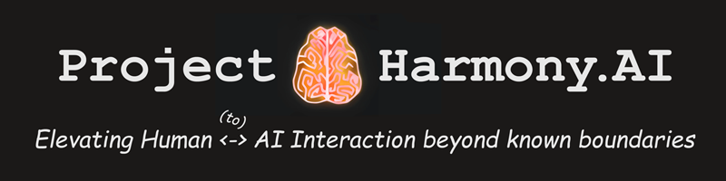

# Project Harmony.AI - VNGE-Plugin for Harmony Link

---

The VNGE-Plugin for Harmony Link is an Event-Layer Plugin for Project Harmony.AI's [Harmony Link AI-middleware](https://github.com/harmony-ai-solutions/harmony-link).

It is completely written in IronPython and builds upon [Keitaro's](https://www.patreon.com/KeiPlugins/) 
VNGE (Visual Novel Game Engine) Mod for a series of recent
Unity based Games made by japanese games company [Illusion](https://en.wikipedia.org/wiki/Illusion_(company)).

By implementing Harmony Link's Events API, it allows Players to extend Ingame Characters with AI-Powered functionality,
such as Real-Time Conversation Abilities (Using AI Language models, Speech-to-Text and Text-to-Speech) and basic non-verbal
Expressions and Interaction capabilities, turning them into interactive virtual companions.

We're still missing a proper showcasing video, however, you can get an Impression from this recent Developer VLOG:
https://drive.google.com/file/d/13KTgbJuc-fSqjGG4Js1J7G6uubg3wxWt/view?usp=sharing

Towards the end of the Beta Phase, we're planning to create a more detailed Feature Showcase.

Currently, this Plugin as well as Harmony Link is still in an early development stage, and therefore is merely a tech
demonstrator, rather than a fully fledged AI companion solution. However the long term development goal for Characters
powered by Harmony Link is to allow them to freely move around in the virtual environment and interact with the Player
and other AI powered entities "at their will".

*For more details about the project as well as how you can support and get in touch with us, see* 
*[About Project Harmony.AI](#about-project-harmonyai) and [How to reach out](#how-to-reach-out-to-us) below.*

## Announcements
- 2023-09-17: **Version 0.1.8-beta2** released. For the full list of updates see our
  [Changelog](https://project-harmony.youtrack.cloud/articles/HARMONY-A-10/Releases-Changelog).
- 2023-08-17: Closed Beta Nr. 2 launched! Please reach out via [Discord](https://discord.gg/f6RQyhNPX8) if you want to participate.
- 2023-08-17: Also, our brand new [Patreon Page](https://patreon.com/harmony_ai) launched today. It will allow you to directly
  support our project efforts if you find our software useful. 

## Quickstart
To get started quickly, please have a look at our [Quickstart guide](https://project-harmony.youtrack.cloud/articles/HARMONY-A-9/Quickstart).

## Documentation & Resources
For a detailed understanding of Harmony Link and the underlying concepts, as well as for getting started with development
please take a look at our [technical documentation](docs/README.md).

---

## About Project Harmony.AI

### Our goal: Elevating Human <-to-> AI Interaction beyond known boundaries.
Project Harmony.AI emerged from the idea to allow for a seamless living together between AI-driven characters and humans.
Since it became obvious that a lot of technologies required for achieving this goal are not existing or still very experimental,
the long term vision of Project Harmony is to establish the full set of technologies which help minimizing biological and
technological barriers in Human <-to-> AI Interaction.

### Our principles: Fair use and accessibility
We want to counter today's tendencies of AI development centralization at the hands of big
corporations. We're pushing towards maximum transparency in our own development efforts, and aim for our software to be
accessible and usable in the most democratic ways possible.

Therefore, for all our current and future software offerings, we'll perform a constant and well-educated evaluation whether
we can safely open source them in parts or even completely, as long as this appears to be non-harmful towards achieving
the project's main goal.

Also, we're constantly striving to keep our software offerings as accessible as possible when it comes to services which
cannot be run or managed by everyone - For example our Harmony Speech TTS Engine. As long as this project exists,
we'll be trying out utmost to provide free tiers for personal and public research use of our software and APIs.

However, at the same time we'll also ensure everyone who supports us or actively joins forces with us on our journey, gets
something proper back in turn. Therefore we're also maintaining a Patreon Page with different supporter tiers, as we are
open towards collaboration with other businesses.

### How to reach out to us

#### If you want to collaborate or support this Project financially:

Feel free to join our Discord Server and / or subscribe to our Patreon - Even $1 helps us drive this project forward.

 [Harmony.AI Discord Server](https://discord.gg/f6RQyhNPX8)

 [Harmony.AI Patreon](https://patreon.com/harmony_ai)

#### If you want to use our software commercially or discuss a business or development partnership:

Contact us directly via: [contact@project-harmony.ai](mailto:contact@project-harmony.ai)

---
&copy; 2023 Harmony AI Solutions & Contributors

Licensed under the Apache 2.0 License